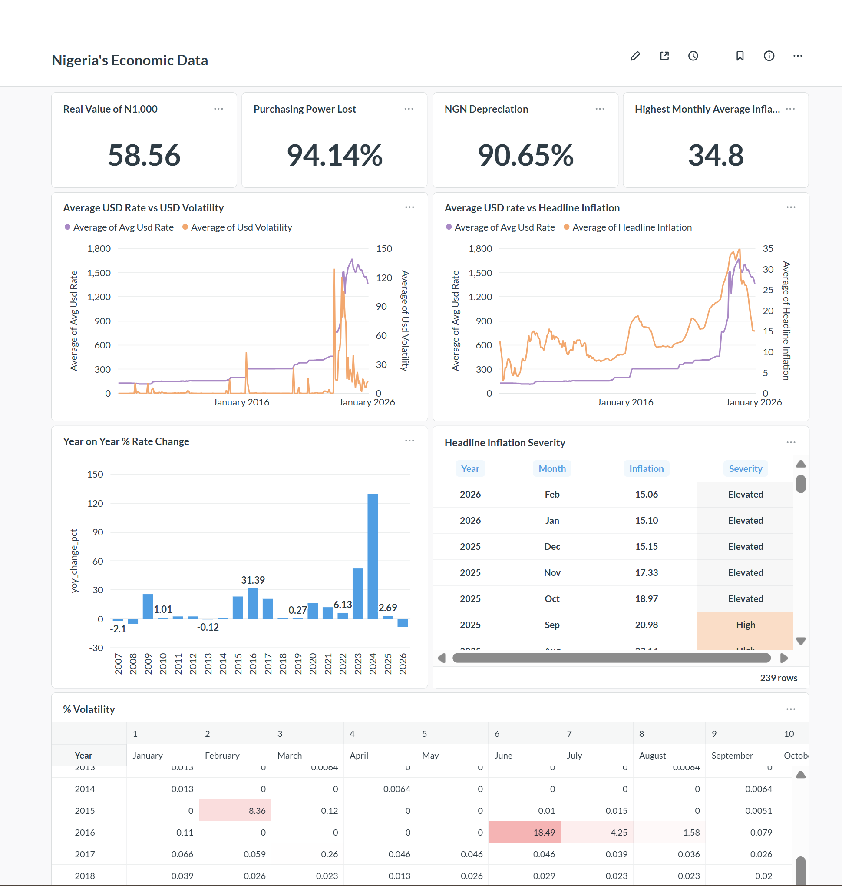

## Automated CBN Macro-Economic Data Pipeline and Analytics

### Tech Stack: Python, Apache Airflow, Spark (PySpark), Docker, HDFS, PostgreSQL.

This is an end-to-end data pipeline and analytics platform that ingests Nigerian economic data using the Central Bank of Nigeria (CBN)'s API endpoint  through a distributed Spark cluster which is thentransformed and is finally into a gold layer in a  PostgreSQL database for further analytics using Metabase.

### Architecture

The project follows the **Medallion Architectur** (Bronze, Silver and Gold Layers)

**Orchestration**: Apache Airflow

**Ingestion**: Python Requests pulling data from API endpoint.

**Storage**: Hadoop HDFS.

**Processing**: PySpark (Transformations).

**Database**: PostgreSQL

**Vizualization**: Metabase

### Insights

The data revealed some sobering truths:

**1**. The naira has lost over 94% of its purchasing power. You only needed about N60 in 2006 to buy what you would buy with N1000 today.

**2**. The Naira depreciated by 90.65% against the Dollar. This means the amount of Naira you need to buy a Dollar has grown by almost 10 X.

**3**. 2024 was the most economically turbulent year in the last 20 years. Nearly every indicator hit critical levels in 2024 with average monthly inflation rate getting as high as 34.80%.

Even though the 20-year data paints a very challenging picture, there appears to be a positive turn in inflation rates, exchange rates, and volatility in the last 12 months. We can only hope that this continues consistently.

 

### Major Challenges & Solutions

*Challenge*: Docker-in-Docker pathing and permission "Access Denied" errors during volume mounting.

*Solution*: Implemented internal container bridging (/opt/spark-apps) and configured the Docker socket (666) to allow the Airflow Scheduler to spawn Spark containers dynamically.

*Challenge*: SSL/Handshake failures during driver downloads in docker.

*Solution*: had to download the .jar file (postgresql-42.7.2.jar) which was placed in the spark-apps folder and injected via --jars.

*Challenge*: There was no heatmap chart type in metabase.

*Workaround*: I used pivot tables and added conditional formatting.

